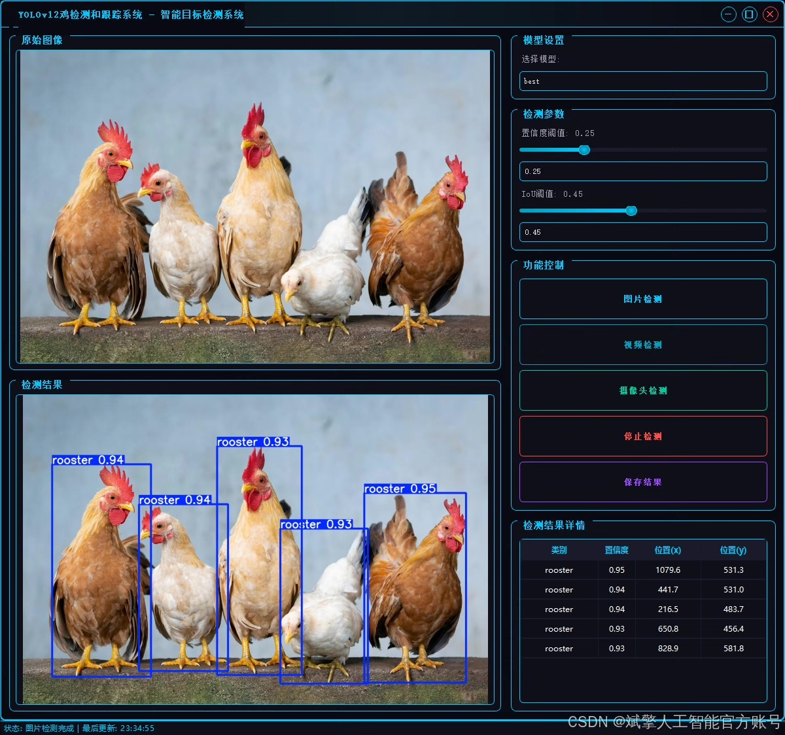
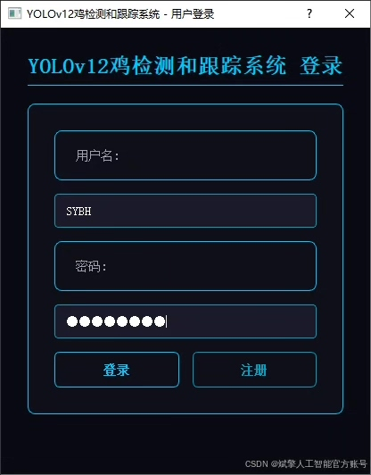
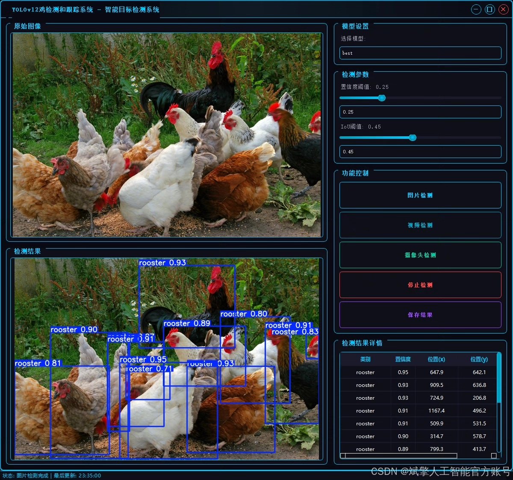
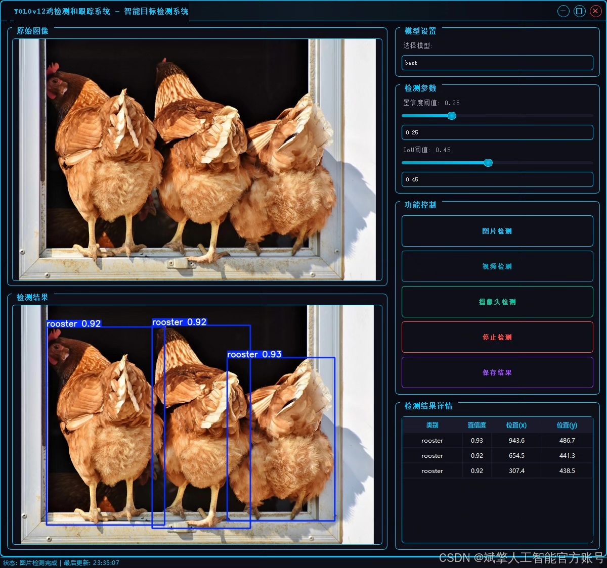
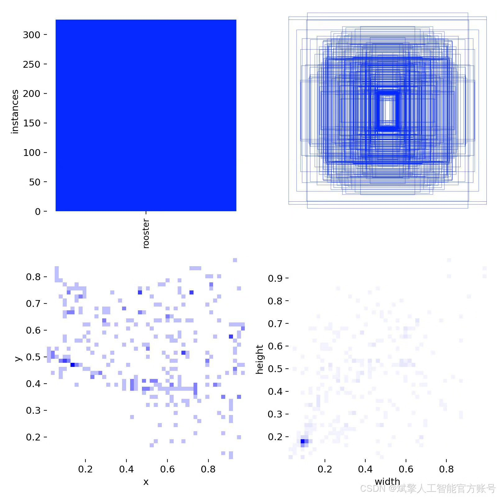
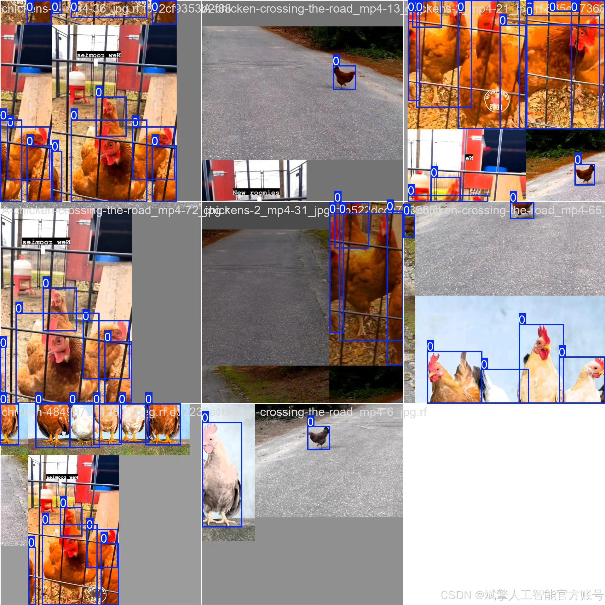
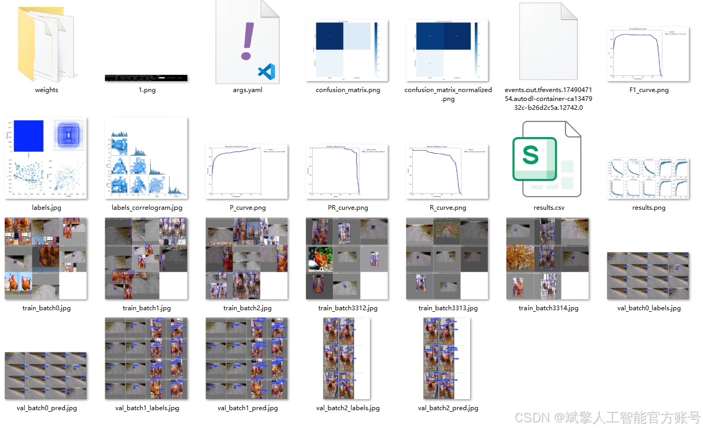
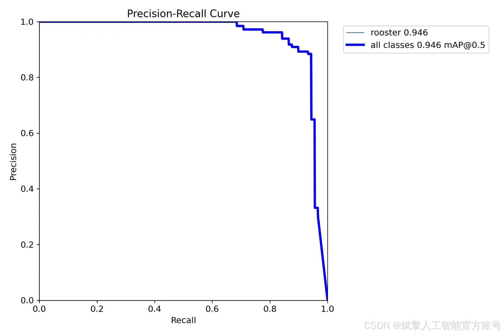
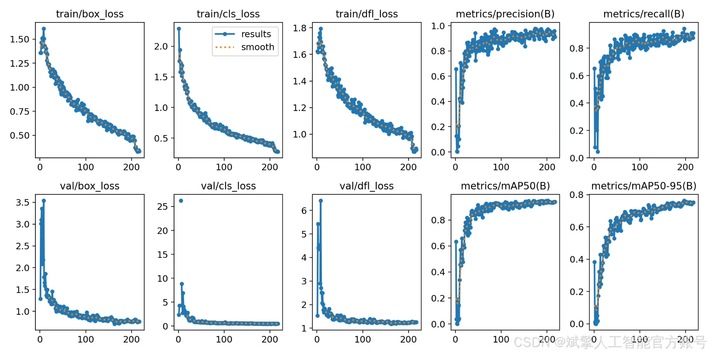

# YOLOv12 chicken detection system

## Body

The YOLOv12 Chicken Detection System is a high-performance system based on the deep learning algorithm YOLOv12, designed and implemented for chicken detection. The system combines the high accuracy and real-time performance advantages of the YOLOv12 model, using the YOLO format chicken detection dataset for training, achieving precise positioning and recognition of chickens.
✅ User Login and Registration: Supports password verification and security validation.
✅ Three Detection Modes: Based on the YOLOv12 model, supports image, video, and real-time camera detection, accurately identifying targets.
✅ Dual Screen Comparison: Displays the original scene and detection results simultaneously on the same screen.
✅ Data Visualization: Real-time table displaying the category, confidence, and coordinates of detected targets.
✅ Intelligent Parameter Tuning: Offers a confidence slide bar to dynamically optimize detection accuracy, adapting to different scene requirements.
✅ Sci-Fi Interactive Interface: Dark theme paired with dynamic light effects, reducing visual fatigue and enhancing operational experience.

## Images

## Payment

Here is a pay link on Stripe ( https://buy.stripe.com/3cs8yP7sY87d0vu9AB ). Please contact me lonlonago@foxmail.com after funding $89, and I will send you a complete data files , thank you!

